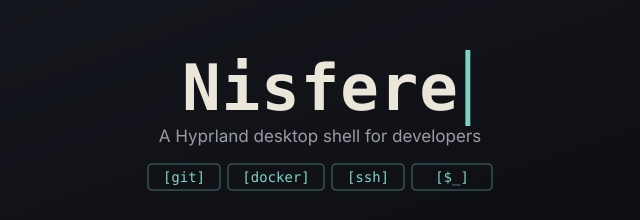

<div align="center">
  



</div>

A Hyprland desktop shell for developers — built-in Git, Docker, and SSH tools, dynamic wallpaper-based theming, and a proper embedded terminal, all in [Quickshell](https://quickshell.org).

https://github.com/user-attachments/assets/e6272d91-d5a1-4698-995e-2340cf681514

## Features

- **Dynamic theming** — colors extracted straight from your wallpaper (custom chroma extraction), or pick from a set of bundled static themes. Dark/light toggle, live-applies across the shell, Hyprland itself, and the embedded terminal.
- **Dropdown terminal** — multi-tab, built on an embedded [QMLTermWidget](https://github.com/Swordfish90/qmltermwidget) (own patched fork — see [Credits](#credits)), theme-aware, keyboard-triggered (`SUPER+grave` by default).
- **Dock** — macOS-style: pinned + running apps together, click to focus (cycles through multiple windows of the same app), right-click to pin/unpin.
- **Developer tools, built in**:
  - Git repo manager — browse repos, open a terminal in one, jump straight to a folder
  - Docker dashboard — containers and Compose projects, start/stop/restart from search or the dashboard
  - SSH quick-connect — recent/most-used hosts ranked automatically, straight from your `~/.ssh/config`
- **Unified search/launcher** — apps, SSH hosts, git repos, Docker containers, clipboard history, file search, web search, and arbitrary shell commands, all through one search bar with `@keyword` scoping
- **Dashboard** — system monitor, media controls, notifications, weather, settings — all in one place
- **Control Center** — WiFi, Bluetooth, quick toggles
- A whole lot of smaller things: screenshot/screen-recording tools, a color picker, clipboard history, workspace overview, and more

## Requirements

- Arch Linux (this installs system packages via `pacman`/`yay`)
- Willingness to hand your session over to Hyprland — this is a full desktop environment, not a theme layered on top of something else

## What gets installed

`install.sh` pulls everything through `yay`, grouped roughly like this:

- **Core** — Hyprland, hypridle, Quickshell
- **Session/portals** — xdg-desktop-portal (+ hyprland/gtk backends), polkit-kde-agent, xdg-user-dirs
- **Networking & Bluetooth** — NetworkManager, bluez/bluez-utils
- **Audio** — PipeWire (+ pulse/alsa/jack compat), WirePlumber
- **Theming** — adw-gtk-theme, Papirus icons (+ papirus-folders), Breeze, qtengine, Bibata cursors, Noto (+ Nerd Font) fonts
- **File management** — Thunar (+ volman/archive-plugin), gvfs (+ mtp/gphoto2), udisks2, Tumbler thumbnails, zip/unzip/p7zip/unrar
- **Terminal & shell** — Alacritty, Zsh, bpytop, fastfetch, cava
- **Screenshots & recording** — grim, slurp, wf-recorder, hyprpicker
- **Utilities** — cliphist, wlsunset, brightnessctl, wl-clipboard, trash-cli, jq, pacman-contrib
- **Daemon dependencies** — python-jinja, python-psutil, python-pillow, python-numpy


## Install

**Quick, one-line install:**
```bash
bash <(curl -fsSL https://gist.githubusercontent.com/Nisfeight8/da3b7a7f7e89beead548fccae47c6c6f/raw/install-nisfere.sh)
```
> Uses process substitution (`bash <(...)`), not a pipe — `install.sh` has a few `[y/N]` prompts along the way, and those need your real terminal's stdin to work.

**Manual install:**
```bash
git clone https://github.com/Nisfeight8/Nisfere.git
cd Νisfere
chmod +x install.sh
./install.sh
```

**Preview first, change nothing:**
```bash
./install.sh --dry-run
```

**Updating an existing install:**
```bash
git pull
./install.sh --update
```

Full details, what each step does, and troubleshooting: see [INSTALL.md](<link-to-your-install-gist-or-file>).

## Keybinds (defaults)

| Key | Action |
|---|---|
| `SUPER + R` / `SUPER + Space` | App launcher |
| `SUPER + grave` (`` ` ``) | Toggle dropdown terminal |
| `SUPER + D` | Dashboard |
| `SUPER + N` | Control Center |
| `SUPER + T` | Theme / color switcher |
| `SUPER + W` | Wallpaper picker |
| `SUPER + Shift + V` | Clipboard history |
| `SUPER + X` | Power menu |
| `SUPER + L` | Lock screen |
| `SUPER + Tab` | Workspace overview |

Full list in [`dots/hypr/modules/keybinds.lua`](dots/hypr/modules/keybinds.lua) — every shell action goes through `qs ipc call <target> <action>`, so remapping anything is just editing that file.

## Architecture

- **Shell** — QML, [Quickshell](https://quickshell.org), lives in `shell/`
- **Daemon** — Python, owns theming/state (`daemon/`), talks to the shell over a Unix socket, socket-activated via systemd `--user`
- **Templates** — Jinja2, render theme values into Hyprland config, GTK, the terminal's colorscheme, etc. (`templates/`, `templates.json`)

## Configuration

- Wallpapers: drop images into `~/Pictures/Wallpapers/`
- Themes: `themes/` — JSON files, `<name>-dark.json`/`<name>-light.json`
- Everything installed lives under `~/.config/nisfere` (daemon + shell + templates + themes), symlinked from `~/.config/quickshell`

## Customization

### Your own templates

`templates/` holds the Jinja2 templates that get rendered on every theme change (Hyprland config, GTK, the terminal's colorscheme, etc.), and `templates.json` maps each one to where it gets written. Drop your own `.template` file into `templates/`, add an entry to `templates.json` pointing at the file(s) it should render to, and the daemon renders it automatically alongside everything else — no code changes needed. Any `{{ variable }}` from the active theme's `colors`/`special` values (see below) is available inside it.

### Your own color themes

Drop a JSON file into `themes/`, named `<your-theme-name>-dark.json` or `<your-theme-name>-light.json` (both, if you want it selectable in either mode) — it shows up in the theme picker automatically, no registration needed elsewhere. Shape:

```json
{
  "alpha": 100,
  "special": {
    "background": "#23262e",
    "foreground": "#d5ced9",
    "cursor": "#f39c12",
    "accent": "#00e8c6",
    "backgroundAlt": "#2a2e38",
    "foregroundAlt": "#7e8086"
  },
  "colors": {
    "color0": "#23262e",
    "color1": "#f92672",
    "color2": "#96e072",
    "color3": "#f39c12",
    "color4": "#00a1f1",
    "color5": "#c74ded",
    "color6": "#00e8c6",
    "color7": "#d5ced9",
    "color8": "#2a2e38",
    "color9": "#f92672",
    "color10": "#96e072",
    "color11": "#f39c12",
    "color12": "#00a1f1",
    "color13": "#c74ded",
    "color14": "#00e8c6",
    "color15": "#ffffff"
  }
}
```
`colors.color0`–`color15` are the standard 16-color ANSI-style palette (used by the terminal and anywhere else that needs a full palette); `special` holds the semantic values (actual background/foreground/cursor/accent) most of the shell's own UI reads directly.

## Roadmap

A few things planned but not built yet:

- **Keybind management from the shell** — editing `keybinds.lua` by hand works today, but a proper in-shell UI for viewing/remapping keybinds is planned.
- **Per-window layout mode toggle** — switching an individual window between floating, tiled, and Hyprland's default behavior, from the shell rather than a keybind-only flow.
- **Hyprland layout switching** — swapping between Hyprland's `dwindle`/`master` layouts (and tuning their options) from the shell UI.

## Credits

- [Quickshell](https://quickshell.org) and [Hyprland](https://hyprland.org) — this shell wouldn't exist without either
- [Swordfish90/qmltermwidget](https://github.com/Swordfish90/qmltermwidget) — the embedded terminal is built on this; nisfere uses its own small patched fork (fixes a live-colorscheme-reload bug upstream doesn't have fixed yet) — see `packaging/qmltermwidget-nisfere/`
